A good study/experiment
====

- Avoids
  - confounding variables
  - experimental artifacts
      - negative and positive controls

***


Issues with experimental design: gene expression studies in human populations
===

> quantitative phenotype differs significantly between European-derived and Asian-derived populations

[Common genetic variants account for differences in gene expression among ethnic groups](https://www.ncbi.nlm.nih.gov/pmc/articles/PMC3005333/pdf/nihms245973.pdf)

Issues with experimental design: gene expression studies in human populations
===

> Interestingly, the arrays used to measure expression for the CEU [European-derived] individuals were primarily processed from 2003 to 2004,whereas the arrays used to measure expression for the ASN [Asian-derived] individuals were all processed in 2005–2006.

.

> microarray batch effects appear to be completely confounded with population effects.”

[On the design and analysis of gene expression studies in human populations](https://www.nature.com/articles/ng0707-807)

[reply](https://www.nature.com/articles/ng0707-808)


Issues with experimental design: sediment and herbivory
====


***


[Sediment suppresses herbivory across a coral reef depth gradient](http://rsbl.royalsocietypublishing.org/content/8/6/1016)

stratified with split plot
treatment: air gun and air lift (vacuuming)
control: plastic sheet protection


A good study/experiment
====

Accounts for variability
  - replication
  - randomization
  - blocking
    - stratification
    - clustering    
    
    
Issues with experimental design: experimental lakes
===

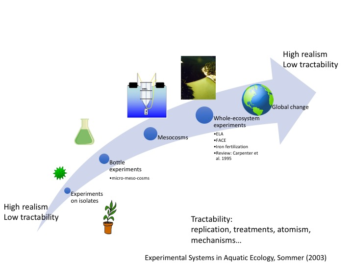


A good study/experiment
====

- Orthogonal explanatory variables (and interactions)
- Balance
- Sufficient power
  - Replication vs pseudoreplication

***


Issues with experimental design: mesocosms
===


A good study/experiment
====

- Feasible!
- Results can be analyzed!


Issues with experimental design: my own experiments (1 of many issues)
===


Challenge with:
- analyzing species vs major taxonomic group
- repeated assays through time/generations
- multiple responses of interest

[The effect of elevated CO2 on growth and competition in experimental phytoplankton communities](https://onlinelibrary.wiley.com/doi/full/10.1111/j.1365-2486.2011.02402.x)

***


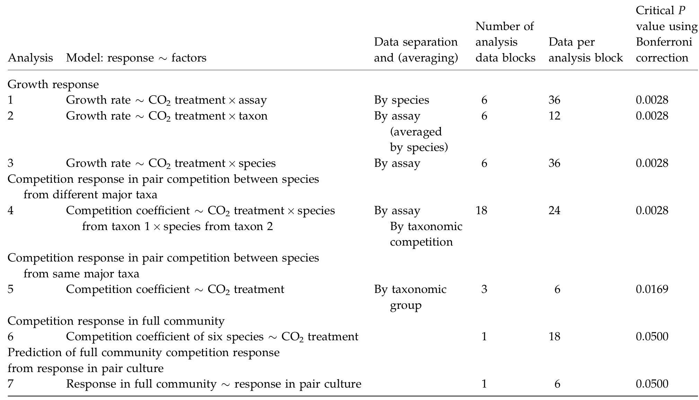


Classes (broad categories)
===

Dependant\Independant| Continuous | Categorical
---|---|---
Continuous | Regression | ANOVA
Categorical | Logistic regression | Tabular


A bestiary of classical experimental designs
===

Many are optimal experimental designs if all required experimental units are available

- repeated measures
- complete randomized design (CRD)
- complete (block)
  - randomized:lattice, randomized complete block design (RCBD)
  - blocking two variables: Latin Square, Youden, Graeco, BIB, , Cyclic, augmented block
  - two variables of interest: split and strip plot Designs
-incomplete:lattice, Alpha design

***


A bestiary of classical experimental designs
===


Famous failures of experimental design
===

Park grass experiment: Started by Lawes and Gilbert in 1856 (162 years old, pre-dates Fisher's work on experimental design at Rothemsted, location of experiment), its original purpose was to investigate ways of improving the yield of hay by the application of inorganic fertilizers and organic manure.

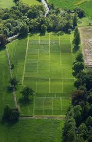


Issues with experimental design: park grass
===

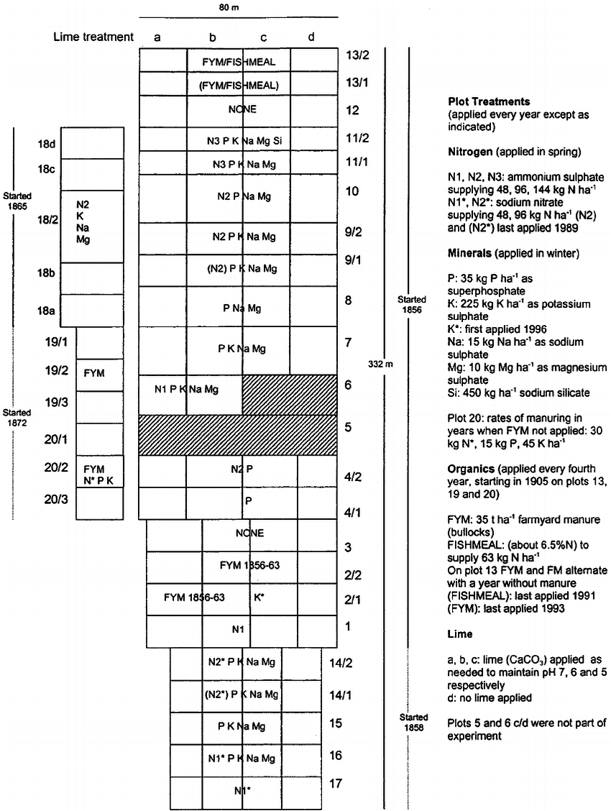


Challenge: Park grass
===

Park grass :
- What questions can you ask with the park grass experiment as it was designed?

Redisgn park grass experiment:

1. Given the experimental units provided (22 rows x 4 columns + 11 cells= 99) which of the park grass experiment questions  (effect of N, P, Na, etc.) would you address and how?
2. Given the questions park grass experiment, come up with a minimal design that addresses the historic set of questions/hypothesis

* Maybe start by listing the treatments and or associated questions.  This could be done by specifying the complete model in R style formula syntax.

Coffee break
===
type: alert

30 minutes


Park grass
===

Analysis despite flaws in experimental design: [Determinants of Species Richness in the Park Grass Experiment](http://oro.open.ac.uk/2295/1/Crawley_etal_2005.pdf)

Park grass inspired experiment using proper experimental design:  [Effects of grassland management on plant C:N:P stoichiometry:implications for soil element cycling and storage](https://esajournals.onlinelibrary.wiley.com/doi/epdf/10.1002/ecs2.1963) (example publication, dozens of related publications)


Why simulate?
===


Why simulate?
===

- Eliminate the need for dice when playing Dungeons and Dragons
- Dry run of experimental design
  - Good allocation of experimental effort
  - vs optimal (ie algorithmic) allocation of experimental effort?
  - vs power analysis (see vignette of `pwr`
- Test/understand a statistical approach
- Explore theory/hypotheses
- Bad reason: Fake data...

[examples](http://serc.carleton.edu/sp/library/datasim//examples.html)

***
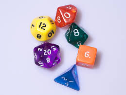

Basic experiment simulation using a spreadsheet
===

- Effect of nitrogen and phosphorus on phytoplankton density in mesocosms
  
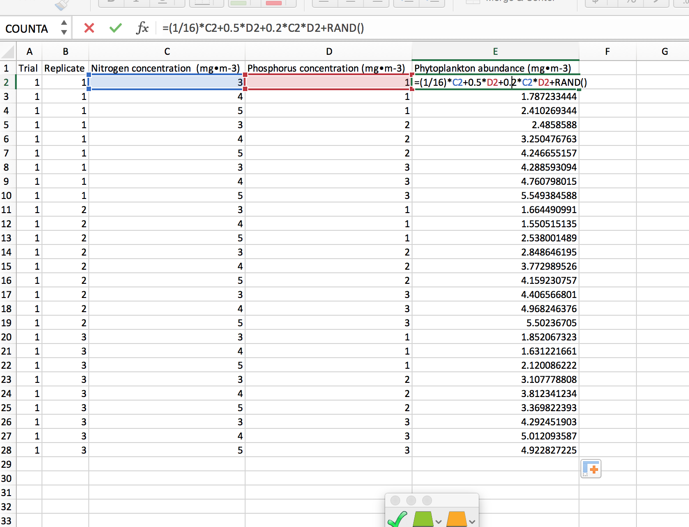


Challenge
===

Create a spreadsheet simulation of an experiment testing :

- testing the effect of nitrogen, phosphorus and [CO2] on chlorophyll in mesocosms

and/or

- testing difference between species in how (supra-optimal or full range) temperature affects their running spead

and/or

- the effect of gear choice and location on fisherman's catch

<div class="centered">

<script src="countdown.js" type="text/javascript"></script>
<script type="application/javascript">
var myCountdown2 = new Countdown({
    							time: 600, 
									width:150, 
									height:80, 
									rangeHi:"minute"	// <- no comma on last item!
									});

</script>

</div>

Issues with experiment simulation using a spreadsheet
===

**What were issues you identified?**


Issues with experiment simulation using a spreadsheet
===

- limited types of distributions
- tedious setup
    - design (repetitive copy pasting)
    - multiple trials (very long sheet)
    - etc.
- **challenge of scaling**
- requires switching to R for downstream steps
- ...


Sampling from a defined population in R
========================================================

Throwing a six face die

Create the die

```r
die <-seq(from=1, to=6, by=1)
```
Throw the die

```r
sample(x=die, size=1, replace=T)
```

```
[1] 3
```

Sampling from a population
========================================================

Throw the 1000 times and keep the results

```r
die_results <- sample(x=die,
                      size=1000,
                      replace=T)
```


Sampling from a population
========================================================

Plot the results

```r
hist(die_results,
     breaks=seq(from=0.5,
                to=6.5,
                by=1))
```
***
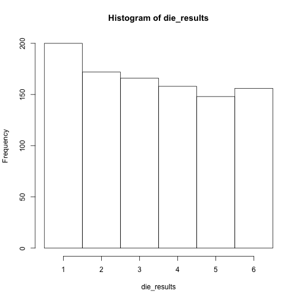


3D die (just because we can)
========================================================

```r
#load TeachingDemos
require(TeachingDemos)
#create the die
rgl.die()
#roll the regular die
roll.rgl.die(steps=10)
```
***
`TeachingDemos` also contains a `dice` that throws `ndice`, `rolls` times

```r
dice(rolls=3,
     ndice=4,
     sides=6,
     plot.it=T,
     load=rep(1, 6))
```

Challenges
========================================================

1. Throw a 10 faced die
2. Throw a coin
3. Throw cheaters die that produces 6 50% of the time


<div class="centered">

<script src="countdown.js" type="text/javascript"></script>
<script type="application/javascript">
var myCountdown2 = new Countdown({
    							time: 300, 
									width:150, 
									height:80, 
									rangeHi:"minute"	// <- no comma on last item!
									});

</script>

</div>

Solutions
========================================================

```r
die10 <-seq(from=1, to=10, by=1)
```


```r
coin <- c("head", "tails")
```


```r
p_dice<-c(1,1,1,1,1,5)
die_results <- sample(x=die,
                      size=1000,
                      replace=T,
                      prob= p_dice)
```

Sampling from a distribution
========================================================

Normal distribution

```r
rnorm(n = number of observations,
      mean = vector of means,
      sd = vector of means)
```

Sampling from a distribution
========================================================

Normal distribution

```r
sample_norm <- rnorm(n = 10000,
                     mean = 10,
                     sd = 1)
hist(sample_norm)
```

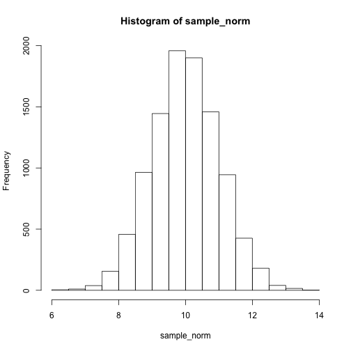

Bestiary of distributions
========================================================

Available in base r:    
beta `beta`, binomial `binom`, Cauchy `cauchy`, chi-squared `chisq`, exponential `exp`, Fisher F `f`, gamma `gamma`, geometric `geom`, hypergeometric `hyper`, logistic `logis`, lognormal `lnorm`, negative binomial `nbinom`, normal `norm`, Poisson `pois`, Student t `t`, uniform `unif`, Weibull `weibull`

[Distribution task view](https://cran.r-project.org/web/views/Distributions.html)

***


Challenges
========================================================

1. Create a sample representing the number of dolphins seen per 10 hours of observation, for 100 observations (hint: assuming this is a number of independent events occurring in a fixed time)
2. Create a sample representing the frequency of species in a quadrat (hint: assuming a few species will be very common and many species will be very rare)

<div class="centered">

<script src="countdown.js" type="text/javascript"></script>
<script type="application/javascript">
var myCountdown2 = new Countdown({
    							time: 300, 
									width:150, 
									height:80, 
									rangeHi:"minute"	// <- no comma on last item!
									});

</script>

</div>


Solutions
========================================================


1.

```r
dolphins <- rpois(n = 1000,
                  lambda = 3)
hist(dolphins)
```

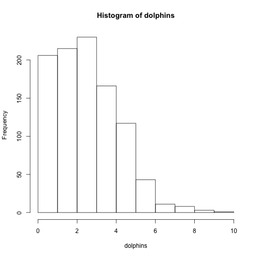


Solutions
========================================================

2.

```r
species <- rlnorm(n = 1000,
                  mean = 25,
                  sd=1)
hist(species)
```

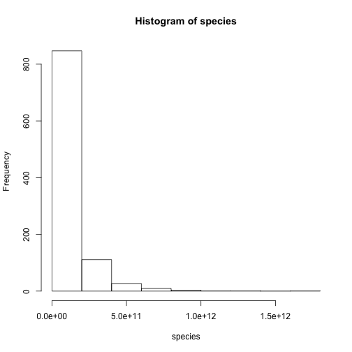


Challenge
===

- Import one of your spreadsheet simulation into R
- Create a plot in R of the data simulated in Excel
- In `R`, create a new column containing simulated values using a more sensible distribution of error

<div class="centered">

<script src="countdown.js" type="text/javascript"></script>
<script type="application/javascript">
var myCountdown2 = new Countdown({
    							time: 600, 
									width:150, 
									height:80, 
									rangeHi:"minute"	// <- no comma on last item!
									});

</script>

</div>

Lunch break
===
type: alert

60 minutes


Simulating an experiment
========================================================

design setup "manually"

Example 2 factors, 2 levels, 3 replicates, full factorial

```r
one_replicate <- data.frame(factorA=factor(rep(c("FacA_Level1",
                                     "FacA_Level2"),
                                     3)),
                            factorB=factor(rep(c("FacB_Level1",
                                     "FacB_Level2", "FacB_Level3"),
                                     each=2)))
head(one_replicate)                              
```

```
      factorA     factorB
1 FacA_Level1 FacB_Level1
2 FacA_Level2 FacB_Level1
3 FacA_Level1 FacB_Level2
4 FacA_Level2 FacB_Level2
5 FacA_Level1 FacB_Level3
6 FacA_Level2 FacB_Level3
```

Alternatives:

- if conducting full factorial, use `expand.grid()`
- create design in spreadsheet and import


Need for scaling of predictors
========================================================


```r
require(cowplot)
one_replicate$response <- with(one_replicate,
                        as.numeric(factorA)*
                          as.numeric(factorB))
```

***

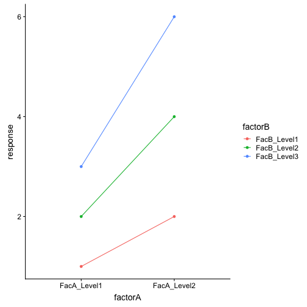


How to scale predictors
========================================================

function to create scaled numeric predictors from all factors

```r
num_scale_fact <- function(data_frame){
  ind <- sapply(data_frame, is.factor)
  data_frame[paste0("num_",names(data_frame[ind]))] <- 
    lapply(data_frame[ind],
                                                              function(x)scale(as.numeric(x)))
  return(data_frame)
}
```


Results of scaling predictors
========================================================


```r
one_replicate <- num_scale_fact(one_replicate)

one_replicate$response <- with(one_replicate,
                        num_factorA*
                          num_factorB)
```

***

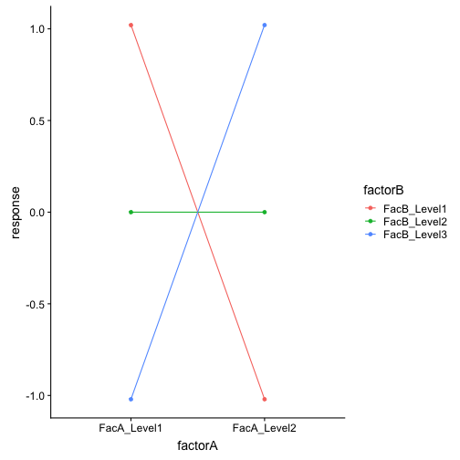


Adding error and replication
========================================================


```r
experiment1 <- NULL
for(i in LETTERS[1:3]){
  one_replicate$replicate <- factor(i)
  one_replicate$response <- with(one_replicate,
                        num_factorA*
                          num_factorB+rnorm(n = 1, sd=2))
  experiment1 <- rbind(experiment1,one_replicate)
}
```

Avoid for loops in this context using the apltly named
`replicate`


Challenge
========================================================

1. Plot experiment 1
2. Analyze experiment 1
- You know that factorA and factorB have an an interactive effect, can you detect this from this experiment?
- If you can detect an effect, what could you do to save money/time etc in this experiment?
- If you can not detect an effect, what would you need to do to detect the known effect?

<div class="centered">

<script src="countdown.js" type="text/javascript"></script>
<script type="application/javascript">
var myCountdown2 = new Countdown({
    							time: 300, 
									width:150, 
									height:80, 
									rangeHi:"minute"	// <- no comma on last item!
									});

</script>

</div>

Solution
========================================================

1.

```r
require(ggplot2)
p <- qplot(data=experiment1,
           x=factorA,
           y=response,
           colour=factorB,
           geom="boxplot")
print(p)
```

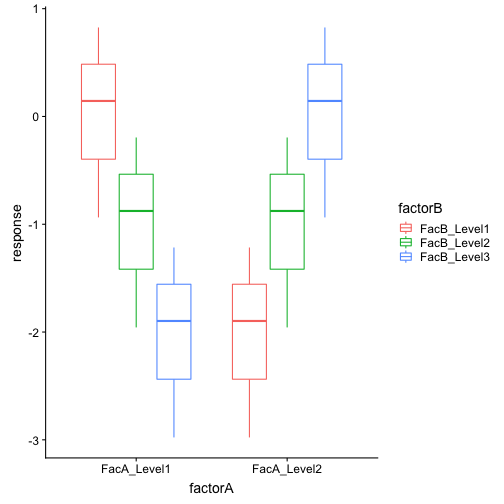
